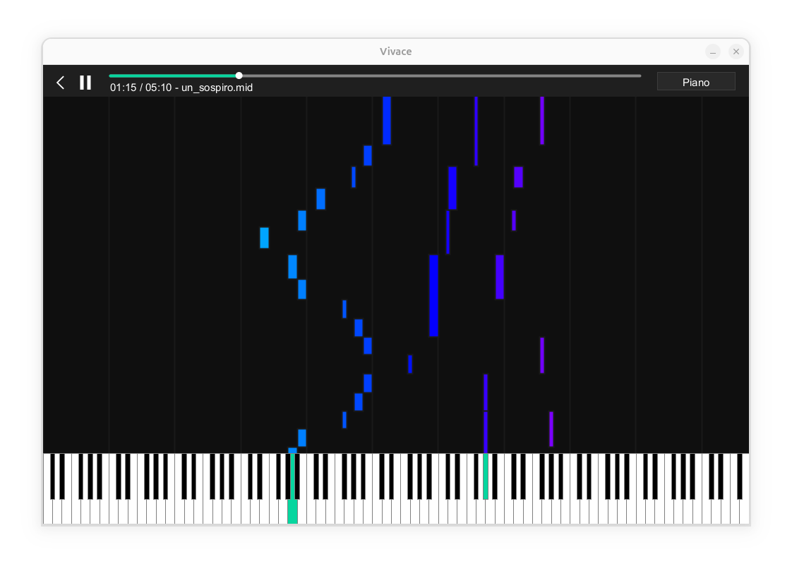

# Vivace

A piano song visualizer app I built as the capstone project in my CS30 class.

### Assets
- Icons come from [here](https://www.svgrepo.com/collection/minimal-ui-icons/)
- Fonts come from [here](https://www.fontspace.com/music-note-font-f109274) and [here](https://font.download/font/arial)
